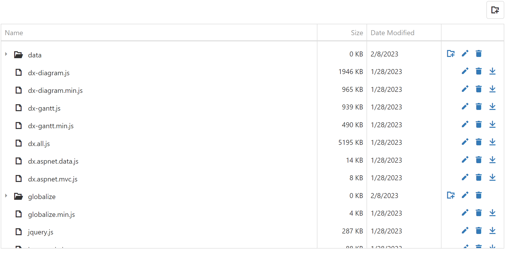

<!-- default badges list -->

<!-- default badges end -->

# TreeList for DevExtreme - How to display and edit file system with the client-side RemoteFileSystemProvider

Commonly, providers from the [File Management](https://js.devexpress.com/Documentation/Guide/Common/Modularity/DevExtreme_Modules_Structure/#file_management) module are used with the [DevExtreme File Manager](https://js.devexpress.com/Documentation/ApiReference/UI_Widgets/dxFileManager/). However, the providers logic is decoupled from the FileManager UI widget. That is why you can use the providers with other client-side components too. 
 

## Files to Review

- [app.component.html](./Angular/myapp/src/app/app.component.html)
- [app.component.ts](./Angular/myapp/src/app/app.component.ts)

## Documentation

- [Getting Started with TreeList](https://js.devexpress.com/Documentation/Guide/UI_Components/TreeList/Getting_Started_with_TreeList/)
- [TreeList - API Reference](https://js.devexpress.com/Documentation/ApiReference/UI_Components/dxTreeList/)
- [RemoteFileSystemProvider](https://js.devexpress.com/Documentation/ApiReference/UI_Widgets/dxFileManager/File_System_Providers/Remote/)
<!-- feedback -->
## Does this example address your development requirements/objectives?

 

(you will be redirected to DevExpress.com to submit your response)
<!-- feedback end -->
